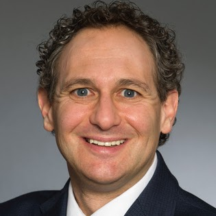
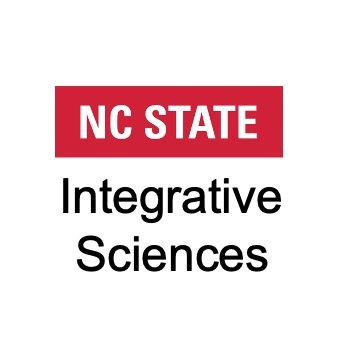

---
# Field school information
title: "PEER-NCSU (Spring, 2026)"
description: "Regional Field School focusing on building community and capacity at North Carolina State University."
leadname: "Scott Franklin"
location: "Raleigh, NC"
host: "North Carolina State University"
image: "ncsu.png"
date: "5/11/2026"
dates: "May 11-14, 2026" # textual date range of the field school, for display purposes.
timing: "future"

# Settings for template, do not change.
toc-location: left
date-format: "MMM D, YYYY"

---

## Join PEER for a 4-day, intensive, in-person PEER Field School!


::: {.quarto-listing .quarto-listing-container-grid .list .grid .quarto-listing-cols-3 .bg-info}

:::{.g-col-1 .card .card-body .text-center .bg-info .border-info}

:::{.bi .bi-geo-alt-fill style="font-size: 70px"}

:::
North Carolina State University<br>
Raleigh, North Carolina
:::


:::{.g-col-1 .card .card-body .text-center .bg-info .border-info}

:::{.bi .bi-calendar-check-fill style="font-size: 70px"}

:::
Field school dates<br>
May 11-14, 2026
:::

:::{.g-col-1 .card .card-body .text-center .bg-info .border-info}

:::{.bi .bi-pencil-square style="font-size: 70px"}

:::

:::


:::


PEER enhances the professional growth of participants and changes career trajectories.  Our comprehensive professional development covers project design, management, mentoring, communication, and understanding community values. This 'full stack' of activities builds your research abilities.  No matter where you are in your education research journey, we'll take you to the next step. 

## Schedule Overview
  
```{=HTML}
<body>
  <iframe id="fs-schedule" src="" width="100%" height="600px" frameborder="0"></iframe>
  <!-- Dynamically set the school name variable -->
  <script>
    // Define the school name variable
    // THIS MUST BE THE SAME AS THE GOOGLE SHEETS PAGE NAME
    var schoolName = "NCSU 2026"; // Change this to the desired school name

    // Encode the school name to make it URL-safe
    var encodedSchoolName = encodeURIComponent(schoolName);

    // Set the src of the iframe with the dynamically generated school name
    document.querySelector("#fs-schedule").src = "../../updated-schedule-pull.html?school=" + encodedSchoolName;
  </script>
</body>
```


To build a supportive community, participants must actively engage during all sessions in the field school.  Partial attendance is not permitted. 

<!-- See more schedule details on the [syllabus](syllabus.qmd) -->

## Who Should Attend?
 
PEER targets a broad diversity of experience and interest in discipline-based education research (DBER). The workshop is appropriate for:

* Faculty not currently engaged in DBER but interested in learning about theories and methodologies for possible future research
* Current DBER researchers looking to build or broaden their network of collaborators and engage in generative discussions about existing and new projects
* Graduate students or postdoctoral researchers who want to learn more about DBER project management and building a successful research program
* Faculty at teaching-focused universities interested in using research methodology to improve or assess their teaching and/or publish in Scholarship of Teaching & Learning

This field school is centered on building regional capacity and community.  We welcome all applicants who work or reside within a three-hour radius of State College; applicants outside of this radius should make a strong case for their current or future ties to the DBER community in this geographic area. 


## What do we do?

### PEER builds core competencies in education research

 PEER enhances the professional growth of participants and changes career trajectories.  Our comprehensive professional development covers project design, management, mentoring, communication, and understanding community values. This 'full stack' of activities enhances research abilities.  We focus on the participants' interests and projects, fostering motivation and improving success chances.  

### Community Building and Networking

PEER promotes peer feedback and community foundation, providing a sense of inclusion in the DBER field and fostering research identity. The networking opportunities at PEER kickstart collaborations and expand professional networks. PEER supports participants from all STEM disciplines, and we focus on emerging education researchers, whatever their career level.  

### PEER builds academic currency

 Our support includes guiding participants in writing, a key element of academic research. PEER engagement leads to numerous publications, grant proposals, and successful tenure & promotion portfolios.  These publications span several years, suggesting PEER's lasting impact on participants’ professional trajectories.
    


<!-- # Application and Registration -->


## Facilitator
:::::: {.quarto-listing .quarto-listing-container-grid}
::::: {.list .grid .quarto-listing-cols-5}

::::{.g-col-1 .text-left}
{fig-alt="Scott Franklin" width="100%"}
::::

:::::
::::::


## Sponsors
::::: {.quarto-listing .quarto-listing-container-grid .list .grid .quarto-listing-cols-2}


::::{.g-col-1}
[{fig-alt="NCSU Integrative Science Initiative" width="20%" .center}](https://science.psu.edu/)

::::
::::{.g-col-1}
This PEER field school is sponsored by the NCSU Integrative Science Initiative.
::::

:::::
